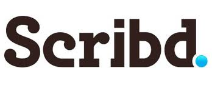

<!SLIDE bullets incremental>
# You have completed RailsBridge #30!
* Congratulations!

<!SLIDE bullets>
# Please thank our awesome sponsor!

<!SLIDE bullets>
# What did we learn?
* Ruby as a language
* Rails as a framework
* MVC design pattern
* Test-Driven Development

<!SLIDE bullets>
# Resources:
* https://gist.github.com/1429661
* Women Who Code Meetup